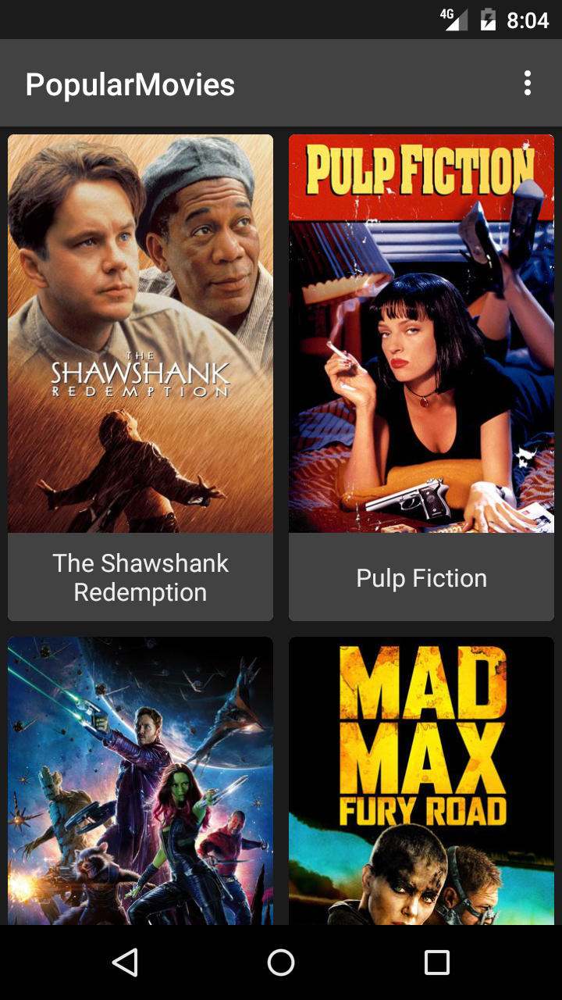
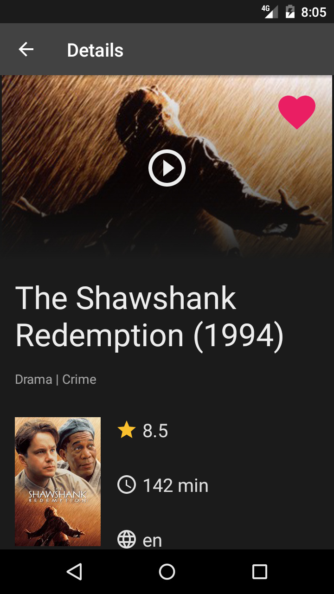
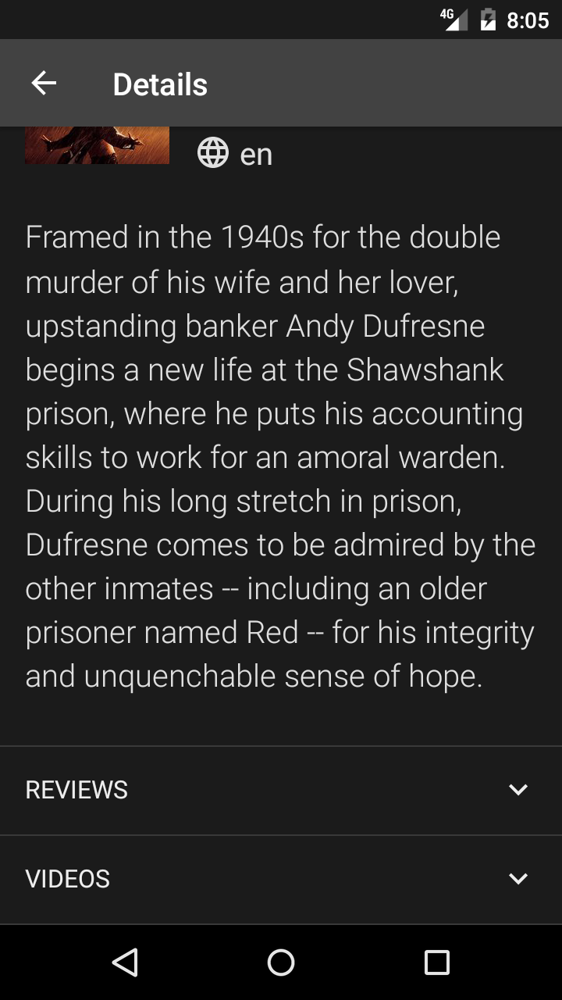
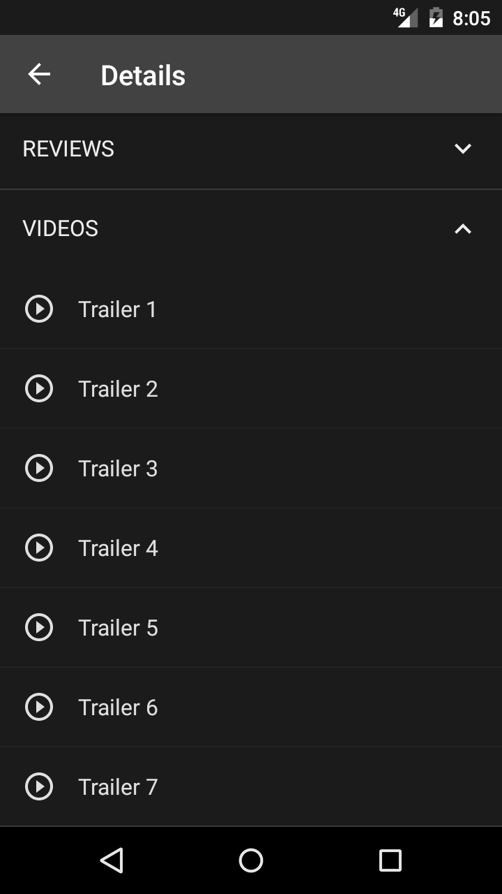
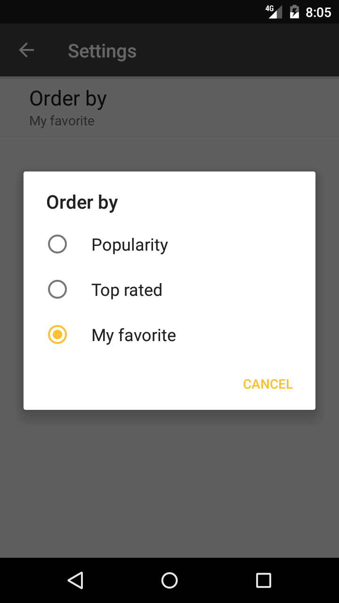

# PopularMovies
This Android app is created under guidance of Android developer nanodegree orgranized by Udacity and Google. https://www.udacity.com/course/android-developer-nanodegree-by-google--nd801

This app allow users to discover the most popular movies playing. The whole project is divided into two stages.
In the first stage, the required functionalities include:
1. Present the user with a grid arrangement of movie posters upon launch.
2. Allow your user to change sort order via a setting. The sort order can be by most popular or by highest-rated
3. Allow the user to tap on a movie poster and transition to a details screen with additional information such as:original title, movie poster image thumbnail, A plot synopsis (called overview in the api), user rating (called vote_average in the api) and release date.

The data used in this app is fetched from themovieDB API https://www.themoviedb.org/documentation/api
In order to work with the code, you're encouraged to apply for an API key starting from creating account in themoviedb.org. 
And then following the step in this page https://www.themoviedb.org/faq/api under the question "How do I apply for an API key?"
After getting API key,  add the following attribute to your gradle.properties file using this format API_KEY = "your api key goes here".
In Android studio, then click on Build -> Rebuild Project. The project will then build and become usable to you.

## Dev Details

- API is wrapped with [retrofit 2.3] (http://square.github.io/retrofit/)
- View and view component onclick are bound with [butterknife] (http://jakewharton.github.io/butterknife/)
- Pictures are shown with [Picasso] (http://square.github.io/picasso/)

## App Screenshots

